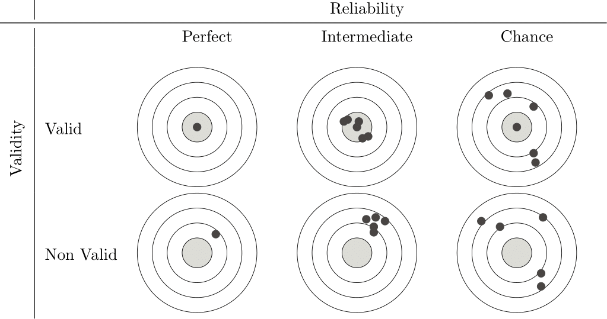
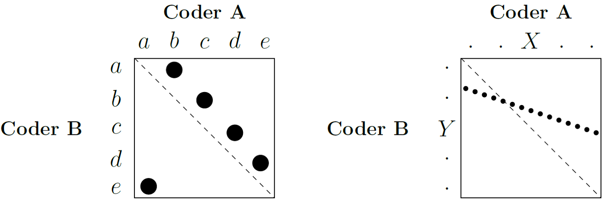
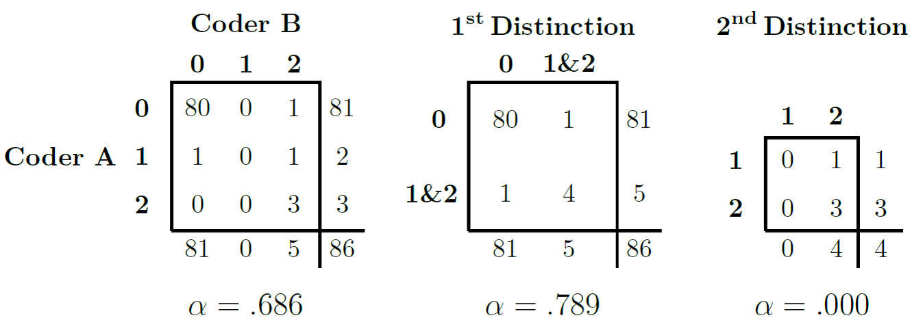

---
output:
  word_document: default
  html_document:
    fig_caption: true
  pdf_document: default
---

# Background {#background}

Before we look at the different applications of Quantitative Text Analysis (QTA), it is a good idea to discuss the basics. This will help us later to understand what we are doing, why, and what QTA can do. In this chapter, we will discuss the basic concepts of QTA, the standard workflow, the concepts of validity and reliability and why they are so important to us.

## Concepts

First of all, let us define what Quantitative Text Analysis actually *is*. While there are various definitions, all agree that with QTA, we focus on *text as data*. Rather than taking the word as it is, we transform it (and other textual features) into numerical representations, which we then use as the input for various applications. Although this transformation means that we have to abstract the meaning of a word into numerical values, by doing so, we can easily examine (very) large collections of documents -- better known as corpora -- and can test pre-defined hypotheses, generalise findings across large datasets, synthesise information, and uncover broad trends that might not be apparent from close reading alone. This ability to work with large datasets is one of the reasons for the explosive growth and interest in QTA in recent years.

We can divide the different applications of QTA into four groups, each with its own focus and preferred techniques:

**Describe:** What are the characteristics of our corpus? In other words, how many documents do we have? What is their word count and vocabulary size? What are the most common terms, and how are they distributed? And what about the metadata - who are the authors of our texts, and when were they written? This descriptive information is crucial for familiarising ourselves with the data, identifying areas for further research and spotting anomalies early on.

**Explore:** What are the main ideas, opinions, perspectives and themes embedded in our texts? Methods such as topic modelling can reveal the underlying thematic structure of a corpus; dictionary-based approaches, machine learning classifiers or sentiment analysis can quantify emotional tone; and readability statistics can provide insights into the complexity and accessibility of the language used. All of these can improve our understanding of the content of the texts and reveal unexpected relationships between them.

**Measure:** Can we measure or create (latent) concepts with our texts? For example, we can use codes from dictionary-based approaches to measure the political left-right position of a party manifesto, or use the frequency of topics in the texts to reveal the agenda priorities of authors or organisations.

**Predict:** How can our data predict future events or test hypotheses about causal effects? Because we see our texts as data, we can use our texts as part of statistical models, such as a regression, to predict outcomes. For example, we could analyse how much a new party manifesto is likely to change the behaviour of voters or legislators, or whether debates on social media affected a previous election.

Note that in most cases, a single research study will combine them to answer its research question. They also build on each other. For example, a descriptive analysis usually precedes an exploratory one, and both are needed to measure or predict.

Often, *Quantitative* Text Analysis is contrasted with *Qualitative* Text Analysis, which focuses on the in-depth interpretation and nuanced understanding of texts, typically working with smaller numbers of documents. Compared to its quantitative counterpart, it emphasises deep immersion in the texts in order to understand their meaning, context and subtleties, allowing us to explore complex phenomena, develop new theoretical insights and provide rich and thick descriptions of our texts. Central to this approach are techniques such as coding to identify key concepts, thematic analysis to uncover recurring patterns of meaning, discourse analysis to study language in its social context, and narrative analysis to understand stories and accounts. Thus, while QTA often focuses on the 'what' aspect of a text, the qualitative approach focuses on answering the 'how' and 'why' questions related to a text.

However, rather than seeing them as opposing methodologies, we should see them as complementary. That is, we can use the two approaches to inform and enrich each other in many ways. For example, a deep qualitative understanding of the context and nuances of a text is invaluable in developing a robust coding scheme or specialised dictionaries that we can use in a quantitative analysis, while quantitative methods can efficiently scan large corpora to find overarching patterns, anomalies or specific subsets of texts that deserve more focused, in-depth qualitative study. As a result, combining the two approaches can lead to more convincing and interesting research and help to address the shortcomings of the other.

$~$

+--------------+-------------------------------------------------------------------------------------------------------------------------------------+--------------------------------------------------------------------------------------------------------------------------------------+
| Aspect       | Quantitative Text Analysis                                                                                                          | Qualitative Text Analysis                                                                                                            |
+:=============+:====================================================================================================================================+:=====================================================================================================================================+
| **Goal**     | To measure, count, and identify patterns, frequencies, and statistical relationships. To test hypotheses.                           | To understand, interpret, and explore meanings, themes, and context. To generate hypotheses or theories.                             |
+--------------+-------------------------------------------------------------------------------------------------------------------------------------+--------------------------------------------------------------------------------------------------------------------------------------+
| **Data**     | Numerical data derived from text (e.g., word counts, frequencies, coded categories represented numerically).                        | Textual data (e.g., interview transcripts, documents, open-ended survey responses, field notes).                                     |
+--------------+-------------------------------------------------------------------------------------------------------------------------------------+--------------------------------------------------------------------------------------------------------------------------------------+
| **Approach** | Objective; aims for generalizability; deductive (tests pre-defined hypotheses).                                                     | Subjective; focuses on depth and richness of specific cases; inductive (develops understanding from the data).                       |
+--------------+-------------------------------------------------------------------------------------------------------------------------------------+--------------------------------------------------------------------------------------------------------------------------------------+
| **Methods**  | Statistical analysis, content analysis (frequency-based), computational linguistics, automated sentiment analysis, topic modelling. | Thematic analysis, discourse analysis, narrative analysis, interpretative phenomenological analysis, grounded theory, close reading. |
+--------------+-------------------------------------------------------------------------------------------------------------------------------------+--------------------------------------------------------------------------------------------------------------------------------------+
| **Analysis** | Statistical tests, identifying correlations, creating visualisations of numerical patterns.                                         | Coding (assigning labels to text segments), identifying themes, interpreting meanings, and building narratives.                      |
+--------------+-------------------------------------------------------------------------------------------------------------------------------------+--------------------------------------------------------------------------------------------------------------------------------------+
| **Size**     | Large datasets to ensure statistical significance and generalizability.                                                             | Small, purposefully selected datasets to allow for in-depth analysis.                                                                |
+--------------+-------------------------------------------------------------------------------------------------------------------------------------+--------------------------------------------------------------------------------------------------------------------------------------+
| **Focus**    | Breadth of information across many texts; identifying *what* and *how much/often*.                                                  | Depth of understanding within texts; exploring *why* and *how*.                                                                      |
+--------------+-------------------------------------------------------------------------------------------------------------------------------------+--------------------------------------------------------------------------------------------------------------------------------------+
| **Outcomes** | Summaries, statistical significance, generalisable findings, identification of trends.                                              | Rich descriptions, in-depth understanding of context, identification of themes, and development of concepts or theories.             |
+--------------+-------------------------------------------------------------------------------------------------------------------------------------+--------------------------------------------------------------------------------------------------------------------------------------+

: Table 1 - Differences between Quantitative and Qualitative Text Analysis

$~$

For now, let us return to QTA. As we have already noted, the increased availability of (digital) texts and advances in computing power have led to a sharp increase in the popularity of QTA. As a result, there has also been a growing interest in its theoretical underpinnings, such as the work of @Grimmer2013a and @Grimmer2022a. They have sought to identify what QTA can (and cannot) do, and how best to do it. Overall, they stress the importance of six points:

1.  **Theory**: Although QTA is data-driven, theory is inevitable. Thus, any QTA needs some form of theoretical guidance to tell us which texts to choose, how many features to extract, and what questions to ask. Indeed, the question of which method to use depends on our theoretical framework, and any findings we make will only make sense within a particular theoretical context.
2.  **Models are models**: Language is complex. Models, no matter how elaborate and well-constructed, will always be simplifications. As such, we must always remember that we are not working with a text, but with a model of that text.
3.  **Augmentation**: Computers - and thus QTA methods - are very good at organising, calculating and processing large amounts of text quickly, but not so good at understanding, interpreting and reasoning, which is where humans excel. So, a good QTA does not replace us, but complements us.
4.  **No best method**: Our method will always depend on our research question, theoretical framework, and the type of data we are working with. This means that it is perfectly acceptable to choose a simpler method over a more complicated and complex one, as long as it is the right choice for our problem.
5.  **Iteration**: A QTA analysis is rarely straightforward. Instead, the process is often iterative, where we explore the data, apply methods, evaluate results, and frequently return to earlier steps to try other ideas.
6.  **Validation**: Because we are dealing with models, validation is essential to avoid misleading conclusions. We should validate as often and in as many ways as possible, including comparing automated results with human judgment, checking the face validity of results, and testing the predictive power of our measures.

## Workflow

Now that we have seen what QTA is and what we can do with it, let us turn to how we actually go about it. Typically, whatever our objective (describe, explore, measure or predict), we will have a workflow consisting of 10 steps, from defining our research question to interpreting the results, although the exact implementation of each step will vary from project to project:

1.  **Questioning:** We determine what we want to know. What questions do we want to answer? What are our theoretical assumptions?

2.  **Selecting:** We define the scope of the corpus by setting clear criteria for which texts to include and which not to include. We do this by clearly defining our target audience and arguing why we include one text and not another.

3.  **Collecting:** We collect our selected texts to build our corpus. This may involve manual collection, web scraping or using existing text archives and databases. We also need to ensure the texts are in a usable format (e.g. .txt, .pdf, .doc) and have the correct versions.

4.  **Cleaning:** We check our corpus for errors or inconsistencies that may have occurred during collection or conversion. Common problems include incorrect character encoding (e.g. displaying "™" instead of "Ü"). Raw text data is often messy and requires careful inspection and cleaning to avoid later errors. Remember that even text contained in databases usually involves some form of cleaning.

5.  **Transforming:** We transform our corpus into a structured format suitable for analysis. The most common choice is the document-feature matrix (DFM), where rows represent documents, columns represent features (typically words, but can be n-grams or other units), and cell values indicate the frequency of each feature in each document.

6.  **Pre-processing:** We refine our DFM by removing (or at least reducing) noise and irrelevant features. This can include removing stopwords, numbers, and punctuation and applying stemming (reducing words to their root form) or lemmatisation (reducing words to their dictionary form). We can also use weights to emphasise or de-emphasise certain terms.

7.  **Describing:** We describe what our data look like. This may involve calculating descriptive statistics (e.g. word frequencies, document lengths) or creating visualisations (e.g. word clouds, distributions). This allows us to understand the structure of the data, identify patterns and check for any remaining problems.

8.  **Modelling:** We select and apply the method or model of our choice based on our research question. This could be topic modelling, sentiment analysis, classification, or supervised learning techniques. We often have to iterate until we find the correct parameters to achieve optimal performance.

9.  **Interpretating:** We analyse the results using tables, graphs and other visualisations and ask ourselves what our results *mean*. We then relate our findings to our theoretical framework and try to answer our research question.

10. **Validating:** We validate our results. Do the results make sense? Are they logical and expected, and if not, why? We need to validate not only here but at every stage, and we may need to revisit a previous step, e.g., refine corpus selection, improve data cleaning, adjust pre-processing steps, or try different models.

While the time spent on each step may vary, and some steps may occasionally be combined or adapted, this workflow provides a general roadmap for quantitative text analysis. We will follow a similar approach in this book, going through these steps in the next chapters.

## Validation

Of all the steps involved in the QTA workflow, validation is often the one that receives the least attention. However, given that each method is based on some form of machine learning, it is also the most important. In fact, @Grimmer2013a advised to "validate, validate, validate!". The reason is simple. With the large amount of data and the fact that we are simply counting numbers, it is very easy to find evidence for something, especially when it is (very) large data. We should therefore be very sure of what we are doing and whether it makes sense. For this reason, it is a good idea to take a closer look at what validation actually means and how to go about it.

Validation involves two related concepts: reliability and validity. Here, *reliability* refers to our measure's *consistency* (or *stability*). If we have a measure with high reliability, this means that we should get the same results each time we run it - it is stable and not prone to random error or variation. *Validity,* on the other hand, refers to the accuracy or appropriateness of our measure. In other words, if our measure is valid, we measure what we want to measure. If you want to think about it in statistical terms, reliability is the proportion of non-random variance, while validity is the proportion of variance that the observed scores share with the true scores.

```{r  label = validity, echo = FALSE, fig.cap = "Validity and Reliability", out.width = '100%'}

```

Note that reliability and validity are not mutually exclusive. There is no point in having a highly valid measure that is not reliable, or a highly reliable measure that is not valid. Figure \@ref(fig:validity), after @Krippendorff2019a, shows this nicely by comparing our measure with a target, with the hits (the black dots) representing individual measures. What we are aiming for is at the top left: a measurement that hits the target perfectly every time. However, as our reliability decreases, more and more often we are not only hitting the target, but also hovering around it. As a result, high validity but low reliability means that sometimes we hit the target, but whether we do so is a matter of chance. At the same time, high reliability but low validity means that we hit the same spot every time, but always miss the target. So we never measure what we want to measure. So we want our measure to be both valid and reliable if it is to be of any use. Now, let's look at both concepts in a little more detail.

### Validity

Of the two concepts, validity is the more difficult. To understand it a little better, we can divide it into three subtypes: content, criterion, and construct validity [@Carmines1979a]. Each of these focuses on a different aspect of validity and has different issues associated with it.

+------------------------+-------------------------------------------------------------------------------------------------------------------------------------------------------------------------------------------------------------------------------------------------------------------------------------------------------------------------------------------------------------------------------------------------------------------------------------------------------+
| **Content Validity**   | *Does our measure cover all the aspects or dimensions of the concept we are studying?*                                                                                                                                                                                                                                                                                                                                                                |
|                        |                                                                                                                                                                                                                                                                                                                                                                                                                                                       |
|                        | For example, if we design a coding scheme to measure 'political ideology', have we included all the different attitudes to existing economic, social and foreign policy issues? To see if this is the case, we often rely on expert judgement and our own theoretical understanding of the concept.                                                                                                                                                   |
+------------------------+-------------------------------------------------------------------------------------------------------------------------------------------------------------------------------------------------------------------------------------------------------------------------------------------------------------------------------------------------------------------------------------------------------------------------------------------------------+
| **Criterion Validity** | *How well does our measure correlate with other established measures of the same concept?*                                                                                                                                                                                                                                                                                                                                                            |
|                        |                                                                                                                                                                                                                                                                                                                                                                                                                                                       |
|                        | For example, we might test whether a sentiment score we get from social media texts agrees with the results of a public opinion poll on the same topic. Another way might be to use our measure to predict a future outcome and then check that the prediction is correct. For example, we could see if the amount of attention given to specific policies in legislative debates could help us predict future budget allocations for those policies. |
+------------------------+-------------------------------------------------------------------------------------------------------------------------------------------------------------------------------------------------------------------------------------------------------------------------------------------------------------------------------------------------------------------------------------------------------------------------------------------------------+
| **Construct Validity** | *How well does our measure operationalise our concept?*                                                                                                                                                                                                                                                                                                                                                                                               |
|                        |                                                                                                                                                                                                                                                                                                                                                                                                                                                       |
|                        | If it does, we would expect the measure to behave in the same way as the concept. For example, if we develop a measure of "economic uncertainty" from news articles, we would expect it to be negatively correlated with measures of consumer confidence.                                                                                                                                                                                             |
+------------------------+-------------------------------------------------------------------------------------------------------------------------------------------------------------------------------------------------------------------------------------------------------------------------------------------------------------------------------------------------------------------------------------------------------------------------------------------------------+

So, how do we put this into practice? One aspect that generally makes validity more difficult than reliability is that there is very little we can measure. Instead, we have to argue and prove, using a variety of methods, that our measure and overall analysis are indeed valid.

The most common approach is to compare against a *gold standard*. For example, suppose we have access to a human-coded dataset for a subset of our data. In this case, we can compare the output of our (computational) method with these human judgments. Indeed, this is what we will do in Chapter \@ref(supervised-methods), where we will use this to calculate metrics such as accuracy, precision, recall and F1 scores. Related to this is when we use our data to predict other (external) data. For example, we might build a model to explain the overall economy of a country, and then relate this to the country's actual GDP. Somewhat more complicated is when we focus on our analysis's actual *meaning*. This involves asking whether the results generated by our method are conceptually meaningful and make sense to people. In sentiment analysis, for example, we could manually review examples where our model gives strong positive or negative sentiment scores and see if they make sense. Preferably, we would have more than one person do this to avoid being too lenient on the model.

Ideally, we would use as many validation options as possible (a technique also known as triangulation). This way, with each validation, we build confidence and strengthen our argument that our approach is valid.

### Reliability

Reliability, as we saw above, is whether our measurement measures the same thing each time we do it, or, more broadly, whether our analysis would lead us to the same conclusions each time. One thing that helps us here is that reliability is something we can measure (unlike validity). It often comes in three forms: stability, reproducibility and accuracy. The first, *Stability*, refers to how consistent a measurement is over time. For example, if we asked a coder to code the same text on different occasions, we would expect them to code it the same way (also known as within-coder consistency). The second, *Reproducibility* (also known as inter-coder reliability), extends this to multiple coders. This means that independent coders, given the same coding instructions, should produce the same code for the same text. Finally, the third, *Accuracy* (which we also use for validity), compares our coders' codes to a known standard or "true" value. The better the comparison, the more reliable our measure.

The first type - stability - is easy to measure: just repeat the analysis and compare the results. The second - reproducibility - is more complicated. This is because there are several things we want to be able to take into account, such as the ability to account for the categories our coders actually use, a standardised scale for interpretation, appropriateness to the level of measurement of our data (e.g. nominal, ordinal, interval, ratio), correction for chance agreement, and the ability to handle missing data. There are several measures of reproducibility, each with its own strengths and limitations. The simplest and most straightforward is *Percentage Agreement*, where we divide the number of codes the coders agree on by the total number of codes coded. However, this does not consider agreement that could occur purely by chance, therefore overestimates reliability.

Another way of doing this is to use Pearson's correlation coefficient (*r*), as we would assume that we are correlating the codes of one or more coders. However, Pearson's *r* measures linear association, not agreement. Thus, two coders can be in perfect disagreement and still show a strong positive or negative correlation if their disagreements follow a consistent linear pattern.

```{r  label = coders, echo = FALSE, fig.cap = "Perfect agreement between two coders", out.width = '100%'}

```

Consider Figure \@ref(fig:coders), which is an example adapted from @Krippendorff2019a to illustrate this. Suppose we have two coders, A and B, each assigning sentences to five categories, labelled 'a' to 'e'. If, for example, whenever Coder A assigns 'a', Coder B assigns 'e'; and whenever Coder A assigns 'b', Coder B assigns 'a', and so on, they are in perfect disagreement (the example on the right). However, if we calculated Pearson's *r*, we might still find a high correlation. This is because Pearson's *r* only looks at the distances between the values, regardless of their location. For there to be a correlation, it is only necessary for increases or decreases in the category values assigned by one coder to be mirrored by similar directional changes in the other's assignments, a condition that can be met even when there is complete disagreement about the actual categories assigned. For this reason, we generally do not recommend it. Instead, we have the following options:

**Cohen's** $\kappa$ is useful for assessing agreement between *two coders* on *nominal* (categorical) data. It improves on percent agreement because it corrects for chance agreement, based on each coder's individual marginal distributions of codes.

**Scott's** $\pi$ is similar to Cohen's $\kappa$, but we use it when we assume that the two coders are drawing from the same underlying distribution of codes. Consequently, it calculates the chance agreement based on the pooled marginal distribution of codes. Like Cohen's $\kappa$, we use it with two coders and nominal data.

**Fleiss'** $\kappa$ is an extension of Scott's $\pi$ . We use it when assessing the agreement between *multiple coders* (more than two) on *nominal* data. A key requirement for Fleiss' $\kappa$ is that each unit (e.g. document, sentence) must be coded by the same number of coders, although it does not necessarily have to be the exact same set of coders for each unit.

Since each of these three measures has its drawbacks, we will use **Krippendorff's** $\alpha$ here. It improves on the other measures by handling any number of coders, allowing for missing data, and applying to any level of measurement - nominal, ordinal, interval, and ratio. In addition, it calculates the random agreement based on the observed data, rather than assuming any distribution.

We can calculate Krippendorff's $\alpha$ using the formula:

$$\alpha = 1 - \frac{D_o}{D_e}$$

Where $D_o$ is the disagreement we observe between the coders, determined by the distance function we choose to be appropriate for the level of measurement of our data. $D_e$ represents the disagreement we would expect by chance, calculated from the distribution of codes assigned by our coders. Thus, if we obtain a $\alpha$ value of $1.0$, this indicates perfect agreement; $0.0$ indicates agreement at the level of chance alone; and a value below $0.0$ indicates systematic disagreement between our coders. For interpretation, we follow Krippendorff's suggestion that a $\alpha \ge 0.800$ indicates good reliability, while values between $0.667 \le \alpha < 0.800$ may allow us to draw tentative conclusions. We usually consider alpha values below $0.667$ to indicate poor reliability.

However, even $\alpha$ has its limitations, the most problematic being when coders agree on only a few categories and use those categories very often. This inflates the value of $\alpha$, making it higher than it should be.

```{r  label = kripp, echo = FALSE, fig.cap = "Inflation caused by use of a limited number of categories", out.width = '100%'}

```

Figure \@ref(fig:kripp) (based on @Krippendorff2019a) illustrates this point. Imagine a coding task with three categories ($0$, $1$ and $2$). Category $0$ indicates that the coders could not assign a more specific code, while categories $1$ and $2$ represent meaningful codes. If, out of a large number of cases (e.g. $86$), both coders assign category $0$ to the majority (e.g. $80$ cases), this leaves very few cases for us to observe agreement or disagreement on the meaningful categories $1$ and $2$. If we then calculate $\alpha$ over all three categories, we get a moderate value ($0.686$). However, if we then collapse categories $1$ and $2$ into a single category 'meaningful code', distinguishing only between 'meaningful code' and 'no meaningful code' (category $0$), the agreement on this broader distinction suddenly becomes very high, leading to a higher $\alpha$ ($0.789$). On the other hand, if we remove the dominant $0$ category and calculate $\alpha$ only on categories $1$ and $2$ (for the few cases where they were used), the resulting $\alpha$ could be very low (almost $0$). This could happen if a coder did not use one of these categories at all, even if they agreed on the other meaningful category in the remaining cases. This shows how our choice of categories to include in the calculation, and their observed distribution, can significantly influence the resulting $\alpha$ value.

Finally, $\alpha$ depends on our chosen metric (e.g. nominal, ordinal, interval, ratio). If we use an inappropriate metric, such as a nominal metric for data that is actually ordinal, we may ignore valuable information about the ordered nature of the categories, leading us to misunderstand the actual level of agreement achieved by our coders.

To calculate $\alpha$ in R, we use the `irr` package, which provides the `kripp.alpha()` function. To see how this works, we simulate a case where $12$ coders code $10$ sentences into $3$ categories:

```{r kripp-alpha, message=FALSE, tidy=TRUE}
library(irr) # Load the library
set.seed(24) # Setting a seed makes our example reproducible

# We create a matrix with 10 coders (rows) coding 12 sentences (columns) into 3 categories (1, 2, or 3)

reliability_matrix <- matrix(sample(1:3, 10 * 12, replace = TRUE),
                             nrow = 10,
                             ncol = 12)

# Now, we calculate Krippendorff's alpha, specifying the data and method (level of measurement). For this example, we assume nominal data.

k_alpha_nominal <- kripp.alpha(reliability_matrix, method = "nominal")
print(k_alpha_nominal)
```

When we run `kripp.alpha`, the output typically includes the calculated $\alpha$ value, the number of units (which it refers to as subjects), the number of coders (raters), and the level of measurement we specified for the calculation (e.g. "nominal"). We then compare this resulting $\alpha$ value with established thresholds (e.g. $0.67$ or $0.80$, as Krippendorff suggests) to assess our coding reliability. For a more nuanced understanding of the stability of our estimate, we can obtain bootstrapped confidence intervals for $\alpha$ using packages such as `kripp.boot` (see [here](https://github.com/MikeGruz/kripp.boot)).

In addition, we can also visualise our reliability. One way of doing this, adapted from @Benoit2009a and @Lowe2011a, is to use bootstrapping to estimate and visualise the uncertainty around each coder's distribution of codes across the different categories. To do this, we first obtain the number of times each coder used each specific category. Then, for each coder, we use their observed coding patterns (i.e., the proportion of times they used each category) to repeatedly resample their codings, typically using a multinomial distribution. From these numerous bootstrapped samples, we compute summary statistics such as the mean percentage and standard error for each category for each coder. Finally, we plot these mean percentages along with their confidence intervals. This allows us to visually represent the consistency of each coder and identify any significant variation in their application of the coding scheme. As before, let's simulate the coding output of 12 coders across 3 categories and see how this works:

```{r reliability-bootstrap, message=FALSE, tidy=TRUE}
library(dplyr)
library(tidyr)
library(ggplot2)

set.seed(48)

# Create placeholder data to simulate coder output. This tibble will have coder IDs and counts for three hypothetical categories (c00, c01, c02)

data_uncertainty <- tibble(
  coderid = 1:12,
  c00 = rpois(12, 50), # Simulating counts for category 0
  c01 = rpois(12, 20), # Simulating counts for category 1
  c02 = rpois(12, 10)  # Simulating counts for category 2
) %>%
  mutate(n = c00 + c01 + c02) # Total codes per coder

category_cols_id <- c("c00", "c01", "c02")

# Now, we perform the bootstrap
n_coders <- nrow(data_uncertainty)
n_repl <- 2000 # We set the number of bootstraps
n_categories <- length(category_cols_id)

# We prepare an array to store our bootstrap results: coder x category x replicate
bootstrap_results_array <- array(
  NA,
  dim = c(n_coders, n_categories, n_repl),
  dimnames = list(data_uncertainty$coderid, category_cols_id, 1:n_repl)
)

# We loop through each coder to resample their codings.
for (coder_idx in 1:n_coders) {
  observed_counts <- as.numeric(data_uncertainty[coder_idx, category_cols_id])
  total_codes_n <- data_uncertainty$n[coder_idx]
  
  observed_probs <- observed_counts / total_codes_n
  # We ensure probabilities sum to 1
  if (abs(sum(observed_probs) - 1) > 1e-6) {
    observed_probs <- observed_probs / sum(observed_probs)
  }
  
  # We perform multinomial resampling
  resampled_counts_matrix <- rmultinom(n = n_repl, size = total_codes_n, prob = observed_probs)
  bootstrap_results_array[coder_idx, , ] <- resampled_counts_matrix
  
}

# We convert counts to percentages
bootstrap_percentages_array <- sweep(
  bootstrap_results_array,
  MARGIN = c(1, 3),
  data_uncertainty$n,
  FUN = "/"
) * 100
# Handle potential NaN if a coder had 0 codes for 'n'
bootstrap_percentages_array[is.nan(bootstrap_percentages_array)] <- 0

# Calculate summary statistics
mean_perc <- apply(bootstrap_percentages_array, c(1, 2), mean, na.rm = TRUE)
# Use the SD of the bootstrapped means as an estimate of the standard error
sd_perc <- apply(bootstrap_percentages_array, c(1, 2), sd, na.rm = TRUE)

mean_perc_df <- as.data.frame.table(mean_perc, responseName = "mean_p") %>%
  rename(coderid = Var1, category = Var2)
sd_perc_df <- as.data.frame.table(sd_perc, responseName = "se_p") %>%
  rename(coderid = Var1, category = Var2)

vis_data <- full_join(mean_perc_df, sd_perc_df, by = c("coderid", "category")) %>%
  mutate(
    lower_ci = mean_p - 1.96 * se_p, # 95% CI lower bound
    upper_ci = mean_p + 1.96 * se_p, # 95% CI upper bound
    lower_ci = pmax(0, lower_ci), # Ensure CI doesn't go below 0%
    upper_ci = pmin(100, upper_ci), # Ensure CI doesn't exceed 100%
    coderid = factor(coderid)        # Treat coderid as a factor for plotting
  )

# Finally, we plot the three categories:

categories_to_plot <- category_cols_id[1:min(3, length(category_cols_id))]
plots_list <- list() # To store plots if we generate multiple

for (cat_to_plot in categories_to_plot) {
  plot_data_subset <- filter(vis_data, category == cat_to_plot)
  
  p <- ggplot(plot_data_subset, aes(x = mean_p, y = coderid)) +
    geom_point(size = 2) +
    geom_errorbarh(aes(xmin = lower_ci, xmax = upper_ci),
                   height = 0.2,
                   na.rm = TRUE) +
    scale_x_continuous(name = "Mean Percentage Coded (%) with 95% CI", limits = c(0, NA)) +
    scale_y_discrete(name = "Coder ID") +
    ggtitle(paste("Our Analysis of Coder Usage for Category:", cat_to_plot)) +
    theme_classic()
  
  plots_list[[cat_to_plot]] <- p
  print(p) # Display the plot
}
```

In these plots, the horizontal bars represent the 95% confidence intervals we derived from the bootstrap resampling process. When we see shorter bars around a coder's mean percentage, this indicates high consistency (low uncertainty) in that coder's use of that category relative to their overall coding activity. On the other hand, longer bars indicate greater uncertainty, which could be due to the coder's less frequent or less consistent use of that particular category. When comparing between coders, overlapping confidence intervals indicate that the coders used the category at statistically similar rates. However, non-overlapping intervals may indicate systematic differences in how a particular coder interpreted or applied a category compared to their peers. Graphs such as these can help us identify specific categories or coders that contribute most to disagreement, and we can use them to improve our coder training or refine our coding scheme.
